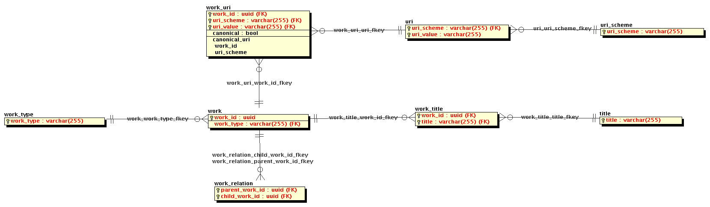

# Identifiers Database
Postgres database of work URIs

## Instructions

Start a database instance:
`
docker run --name identifiers_db -e POSTGRES_PASSWORD=mysecretpassword -e POSTGRES_DB=identifiers_db -e POSTGRES_USER=obp -d openbookpublishers/identifiers_db
`

## Schema

